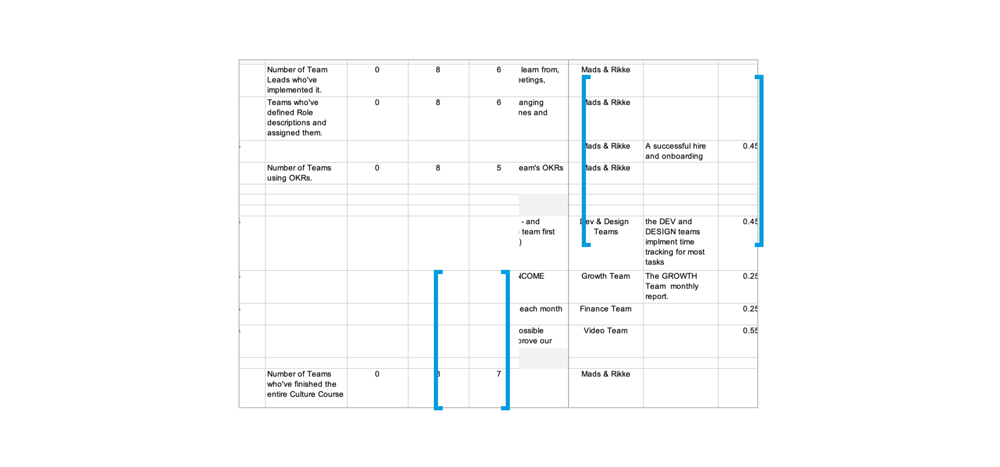

---
sidebar:true
---

# Create Your OKRs

## Familiarize yourself with the OKR Planning Spreadsheet

What you do now:

1. Please familiarize yourself with the spreadsheet called “IxDF OKR Planning.xlsx”, which you will find in the folder “\IxDF Dropbox\IxDF - PeopleOps - Job Roles and Organizational Structure”.
2. Study some examples of Objectives, Key Results, and how we measure them really closely.
3. Read all the “help bubbles” that explain the contents of the cells.
4. Don’t worry if you don’t fully understand what’s going on when you read the spreadsheet. We’ll explain on the next slides.

After you’re done, proceed to the next slide. Now it’s your turn to define Objectives, Key Results, and some KPIs to measure the progress of your Key Results before your Quarterly OKR Planning Meeting.

## Fill Out Spreadsheet Before Quarterly OKR Meeting

What you do next:

1. Fill out the relevant part of the next quarter’s tab in the IxDF OKR Spreadsheet
    1. If you are a Team Lead, then fill out the Team-wide OKRs, and NOT the Personal OKRs for each Team Member. After that, you hold a meeting with the Executive Level before you hold a meeting with your Team.
    2. If you are a Team Member, then fill out your Personal OKRs, after which you hold a 1:1 meeting with your Team Lead to refine/improve your Personal OKRs and make sure they are aligned with the Team’s.
2. Now you’re prepared to hold the Quarterly OKR Meeting, which is the next step in the process.
    1. If you are a Team Lead you FIRST hold a Quarterly OKR Meeting with the Executive Level to get their feedback and approval. THEN, you hold a Quarterly OKR Meeting with your Team.

## Define Your Objectives

Now, write down your Personal – or your Team’s Objectives. If you’re a Team Lead, you write down your Team’s Objectives. If you’re a Team Member, you write down your Personal Objectives .

1. What are the most important impact(s) that I – or my Team – need to make in the coming quarter?
    1. If you are defining Personal Objectives, then based it on my Team’s Objectives for this quarter
    2. If you are a Team Lead defining your Team’s Objectives, then base it on the IxDF-wide Objectives)

Spend some time brainstorming ideas on sticky notes – while doing deep concentration. Group similar ideas together. From there, distill your ideas down into 3 to 5 aspirational Objectives.

Objectives should be high-level, qualitative statements that are aspirational – not tasks or granular outcomes.

Please refer to the examples you just read in the “OKR Planning Spreadsheet”

## Define Your Key Results

Define your Key Results for each Objective

-   How do you measure progress toward a qualitative goal that is inherently un-measurable? You identify measurable outcomes that indicate you’ve achieved your Objective!
    -   Many people struggle to set Key Results for a qualitative goal. Often they think that qualitative Objectives are unmeasurable. However, by focusing on outcomes it becomes easier.
-   Now, for each Objective that you just defined, think about the results you would see (and can measure) if you reached that objective. Again, these are not tasks or to-dos. These are outcomes/results.
    -   Wrong: “Ship feature X by the end of the quarter.”Right: “Shipping feature X increases new user sign-ups by 10% this quarter.”
    -   Wrong: “Improve customer experience by the end of the quarter.”Right: “Lower customer service calls by X by end of quarter.”
-   If you are the Team Lead:
    -   Assign each Key Result an Owner on the Team. If a Key Result will require collaboration with another Team, great! The Owner should follow up with them afterwards and make sure they’re on board.

Please refer to the examples you just read in the “OKR Planning Spreadsheet”.

## Define Your KPIs

A KPI (Key Performance Indicator) is a metric used to measure something, i.e. it’s an “indicator of performance”. Here’s an example:

-   Objective 1: Become the most popular bootcamp in UX
    -   Key Result 1 for Objective 1: Double the amount of sign-ups from 50 to 100 students per cohort.
        -   KPI for Key Result 1: Number of Students per cohort

As mentioned, the KPI for the Key Result 1 would be “Number of Students per cohort” and you would be able to publish a direct link to the NOVA Bootcamp Control Panel where you can read the always-updated value of that KPI, which may currently be 73 students per cohort.

KPIs are superb (and fun!) ways to measure exact progress. Whenever possible, use KPIs to measure your progress.

## Ramp Up Your Ambition

Are you done defining your Objectives and Key Results? Great! Then it’s time to give them one more iteration!

Please do the following:

1. Review the Objectives and Key Results you’ve defined and ask whether they’re ambitious enough. If you feel totally confident you can hit a Key Result, increase the target by approximately 30% and then create a plan mapping out how you will achieve it. If you’re not at all sure you’ll hit a Key Result target, it’s probably set just right.
2. Make sure the Key Results are articulated well and detailed. You want to be able to score them later on a percentages scale.
3. Go to the next slide about “S.M.A.R.T” and use that as a checklist (see the next slide).
4. Lastly, consider whether you have too many or too few Objectives and Key Results.

## Your OKRs — Your Checklist

## Ensure Your OKRs are S.M.A.R.T

