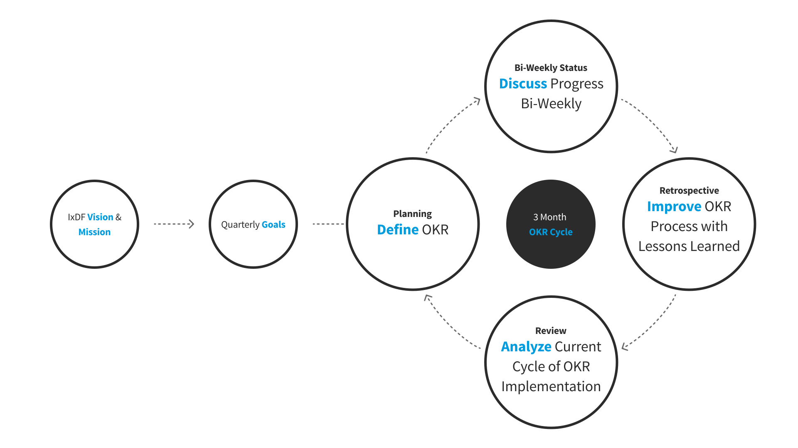

# Our OKR Cadence

A good process is repeatable, has a good cadence. The IxDF OKR process is broken into 3 month cycles.

At the start of each cycle, Quarterly Goals are set for the whole IxDF based on the [Vision](/achieve-purpose/vision.md) and [Mission](/achieve-purpose/mission.md). Teams and Individuals plan and align their OKRs and begin a series of six 2-week Sprints.

At the end of the cycle, each team has an OKR Retrospective to improve the OKR Process and an OKR Review to analyze the progress on each OKR.

By aligning quarterly objectives with annual objectives that are set at the start of the year, it is possible to see how daily tasks contribute to key results, quarterly objectives, annual objectives and the IxDF mission and vision.

This then allows us to align our strategic goals and planning with our daily execution of tasks.

Below is a more detailed view of the our yearly IxDF-wide OKR process.

And here is a view of what this looks like at the team level.

