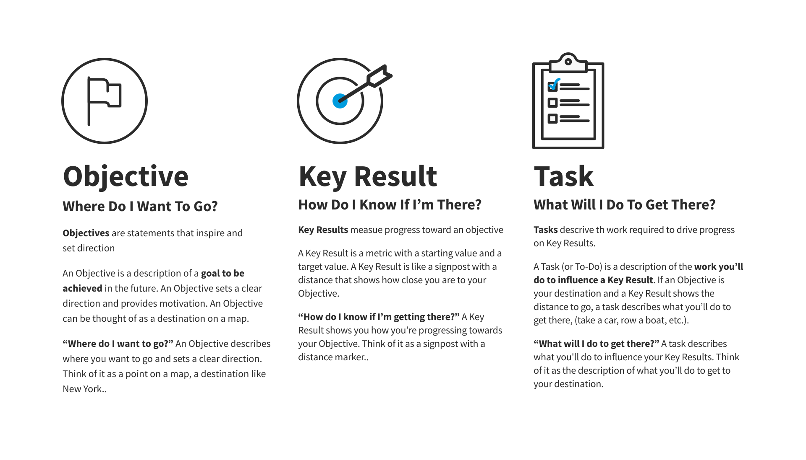
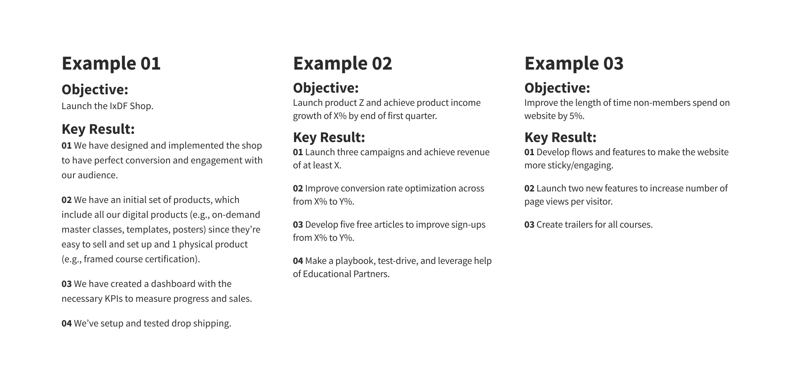
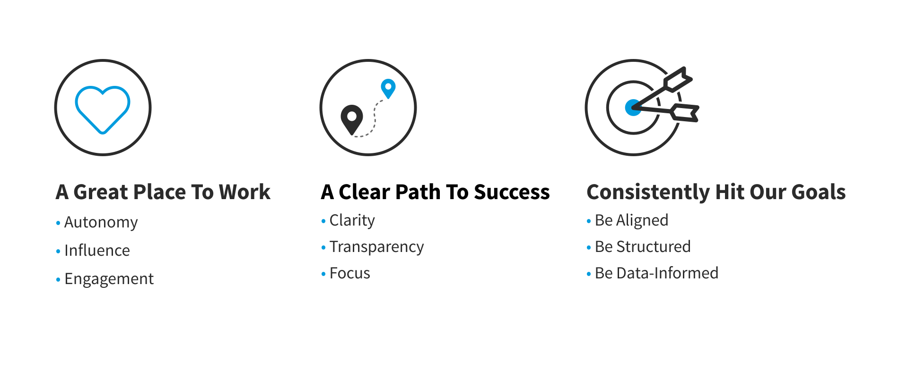

# About OKRs

## WHAT are Objectives And Key Results (OKRs)?

-   The OKR method is a popular strategy for goal setting within organizations.
-   The OKR method combines vision, mission, values and strategy with day-to-day work
-   The OKR method is a collaborative goal-setting tool which we use to realize our vision and mission in the best
    possible way because OKRs connect our organization, Teams, and personal goals to measurable results while having all
    Team Members and Team Leads work together in one, unified direction.

## WHY Do We Use OKRs?

-   OKRs help us realize our vision and mission because OKRs bridge the gap between our vision, mission, and strategy to
    the way we form concrete Objectives and execute Key Results in our daily work.
-   OKRs help us create a weekly, quarterly, and yearly overview over how our daily tasks are connected to our vision and
    help us decide individually, and in our Teams, which steps are the best to take.
-   They help us track our individual and Team progress, create alignment in our Teams and across Teams so everyone moves
    towards achieving the same overall goals.
-   OKRs improve our focus and increase transparency.

## OKR Method — Alignment

## Objective, Key Result and Task — Part 1

## Objective, Key Result and Task — Part 2

## OKR Examples

## Benefits of OKRs

## OKR History

### Historical Development of OKRs

### The OKR Approach and its Relation to Other Methods

